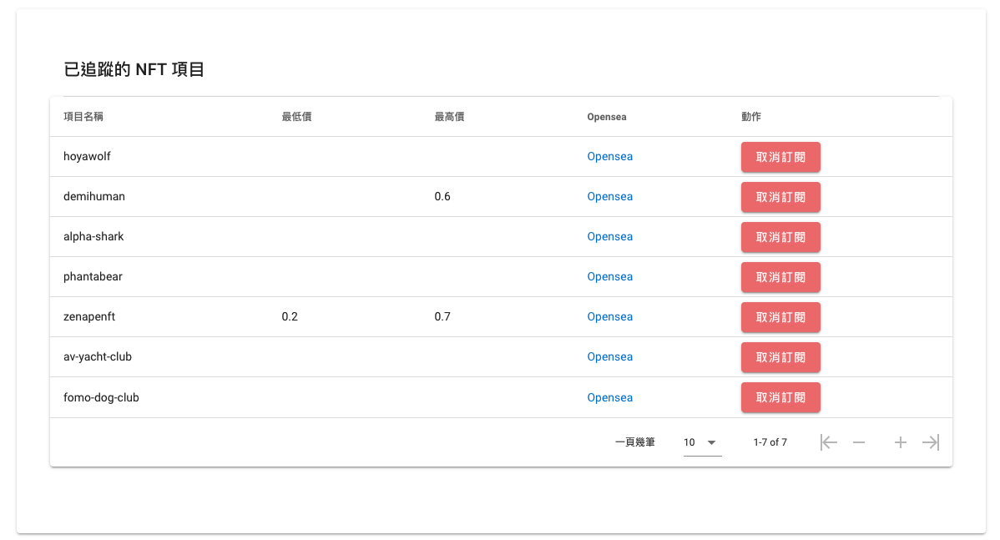
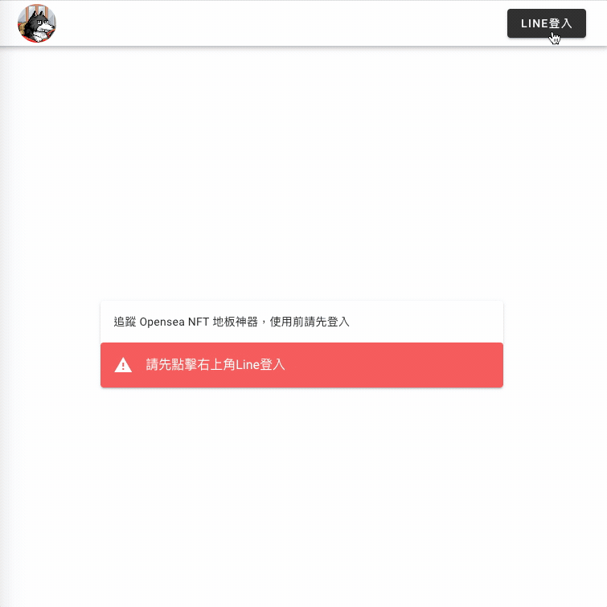
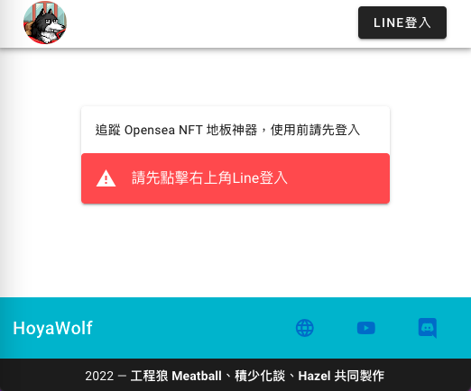
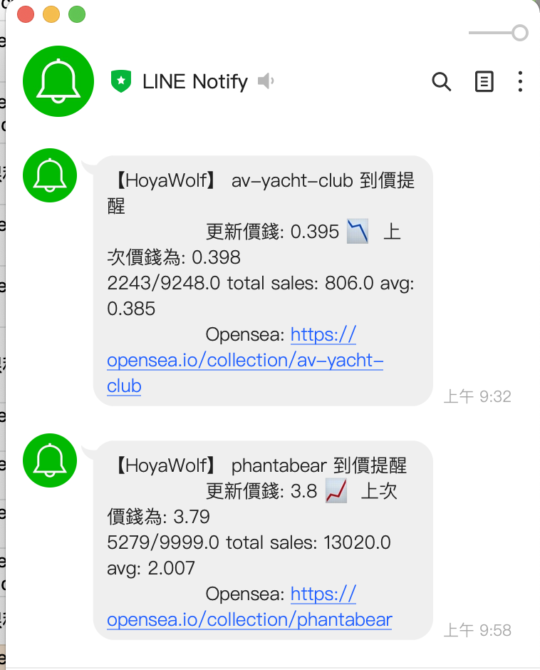

# Opensea 地板價追蹤神器


與 Meatball、Sula 遠端合作，串接 Line 登入及後端 API，SPA 製作 Opensea 地板價推播，負責處理版面設計、前端處理、串接後端 API、串接 Line 登入、Docker 打包前端環境，並採用 vue/essential、eslint:recommended 規範符合 Coding Style。

- ### 開發技術：
|套件|前端|後端|資料庫|版控|
|-|-|-|-|-|-|
|Vuetify|Vue CLI|Python|MySQL|Git||
|vuex-persistedstate|Vue Router|
|AXIOS|Vuex|

- ### 主要功能

  - #### 串接 Line 登入
    - **無登入** 無法使用本專案功能
    - **登入** 登入後可訂閱、查詢已訂閱的NFT項目

  - #### 授權 Line Notify 通知
    
    - 需先 Line 登入後，用 sub id 作為 uniqlo id值，串接後端 API，以sub id 交換拿到 Line Notify Access Token，才可 Line 推播使用者

  - #### 驗證登入
    
    - 除了首頁及Line 登入後的Callback URL(/member/setting)以外，其他頁面需登入後才可使用功能

  - #### 訂閱NFT項目
    
    - **需登入後才可使用**
    - 設計三個 input，輸入項目名稱（必填）、最低（選填）、最高價（選填）與 API 串接，即可訂閱成功，後端每五分鐘排程檢查，若達到使用者設定的價格，觸發 Line Notify，發送通知給使用者
  
  - #### 查詢已訂閱 NFT項目
    - **需登入後才可使用**
    - 串接後端 API，取得資料後顯示在表格內，並做分頁功能，可清楚預覽已訂閱推播通知的項目

  - #### 取消訂閱 NFT項目
    - **需登入後才可使用**
    - 串接後端 API，NFT已訂閱項目點擊「取消訂閱」，將不再推播通知給使用者

- ### 技術文件
  - #### 部署 Docker 打包
  

```
cd hoyawalf_frontend
docker build -t hoyawalf_frontend .
docker-compose up -d
```

### 開發
```
npm install
npm run serve
docker-compose up
docker-compose down
```

### 打包到生產環境
```
npm run build
```

- [API Document](https://api.hoyawolf.tk/docs#/)